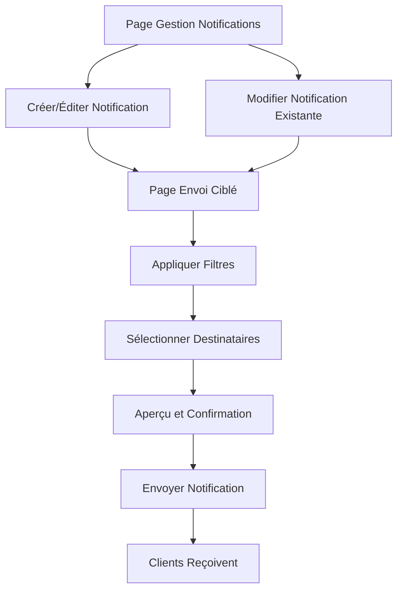

## 1. Vue d'ensemble du produit

Système de gestion des notifications permettant à l'administrateur d'envoyer des messages ciblés aux clients via un filtrage avancé. L'admin peut créer, modifier et supprimer des notifications, puis les envoyer à un ou plusieurs clients sélectionnés selon des critères spécifiques.

## 2. Fonctionnalités principales

### 2.1 Rôles utilisateurs

| Rôle           | Méthode d'accès               | Permissions principales                                                      |
| -------------- | ----------------------------- | ---------------------------------------------------------------------------- |
| Administrateur | Connexion via interface admin | Créer, modifier, supprimer des notifications, filtrer et envoyer aux clients |
| Client         | Recevoir les notifications    | Voir les notifications reçues dans son espace                                |

### 2.2 Module de fonctionnalités

Le système de notifications admin comprend les pages suivantes :

1. **Page de gestion des notifications** : tableau de bord avec liste des notifications, filtres rapides, boutons d'action.
2. **Page de création/édition** : formulaire pour créer ou modifier une notification avec éditeur de texte enrichi.
3. **Page d'envoi ciblé** : sélection avancée des destinataires avec filtres multicritères et aperçu avant envoi.

### 2.3 Détail des pages

| Nom de page               | Module                      | Description des fonctionnalités                                                                       |
| ------------------------- | --------------------------- | ----------------------------------------------------------------------------------------------------- |
| Gestion notifications     | Liste des notifications     | Afficher toutes les notifications avec statut (brouillon, envoyée, archivée), tri par date et titre.  |
| Gestion notifications     | Filtres rapides             | Filtrer par statut, date de création, type de notification.                                           |
| Gestion notifications     | Actions rapides             | Boutons pour éditer, dupliquer, supprimer, archiver une notification.                                 |
| Créer/Éditer notification | Éditeur de notification     | Champ titre, éditeur de texte enrichi, ajout de liens et images, sauvegarde automatique.              |
| Créer/Éditer notification | Paramètres d'envoi          | Type de notification (info, promotion, urgent), date d'expiration, priorité.                          |
| Envoi ciblé               | Filtres avancés             | Filtrer clients par nom, email, date d'inscription, type d'abonnement, localisation, montant dépensé. |
| Envoi ciblé               | Sélection des destinataires | Voir nombre de destinataires correspondant aux filtres, liste aperçu des 10 premiers.                 |
| Envoi ciblé               | Confirmation et envoi       | Résumé de la notification et des destinataires, bouton d'envoi avec confirmation.                     |

## 3. Processus principal

### Flux administrateur :

L'administrateur accède à la page de gestion des notifications → Il peut créer une nouvelle notification ou modifier une existante → Il accède à la page d'envoi ciblé → Il applique les filtres pour sélectionner les destinataires → Il visualise l'aperçu → Il confirme et envoie la notification → Les clients reçoivent la notification dans leur espace.

## 4. Interface utilisateur

### 4.1 Style de design

* **Couleurs principales** : Bleu administrateur (#2563EB) pour les actions principales, gris neutre (#6B7280) pour l'interface

* **Couleurs secondaires** : Vert succès (#10B981), rouge erreur (#EF4444), orange avertissement (#F59E0B)

* **Style des boutons** : Coins arrondis (8px), ombre légère, effet hover avec transition

* **Police** : Inter pour les titres, Roboto pour le corps de texte, taille 14-16px

* **Mise en page** : Cartes avec ombres douces, grille responsive, barre latérale pour la navigation admin

* **Icônes** : Heroicons pour une cohérence moderne et épurée

### 4.2 Aperçu du design des pages

| Page                  | Module               | Éléments d'interface                                                                                            |
| --------------------- | -------------------- | --------------------------------------------------------------------------------------------------------------- |
| Gestion notifications | Tableau principal    | Table avec colonnes titre, type, statut, date, actions. Header avec bouton "Nouvelle notification".             |
| Gestion notifications | Filtres latéraux     | Barre latérale rétractable avec filtres par statut, calendrier pour les dates, bouton réinitialiser.            |
| Créer/Éditer          | Formulaire           | Champ titre en pleine largeur, éditeur WYSIWYG en dessous, barre d'outils d'édition avec gras, italique, liens. |
| Créer/Éditer          | Barre d'actions      | Boutons sauvegarder, sauvegarder et envoyer, aperçu, annuler. Badge indiquant dernière sauvegarde.              |
| Envoi ciblé           | Panneau filtres      | Accordéons dépliants pour chaque type de filtre, compteur de résultats en temps réel.                           |
| Envoi ciblé           | Aperçu destinataires | Mini-tableau montrant 10 premiers résultats, indication du total, bouton "Voir tous".                           |
| Envoi ciblé           | Confirmation         | Card récapitulative avec titre notification, nombre de destinataires, bouton envoi avec icône confirmation.     |

### 4.3 Responsive

Design desktop-first avec adaptation mobile. Sur mobile : menu hamburger, tableaux scrollables horizontalement, formulaires en une colonne, boutons d'action agrandis pour le touch.

## 5. Fonctionnalités avancées

* **Sauvegarde automatique** toutes les 30 secondes lors de l'édition

* **Historique des envois** avec statut de réception par client

* **Templates de notifications** pour une création rapide

* **Programmation d'envoi** pour une date/heure spécifique

* **A/B testing** pour tester différentes versions de notification

