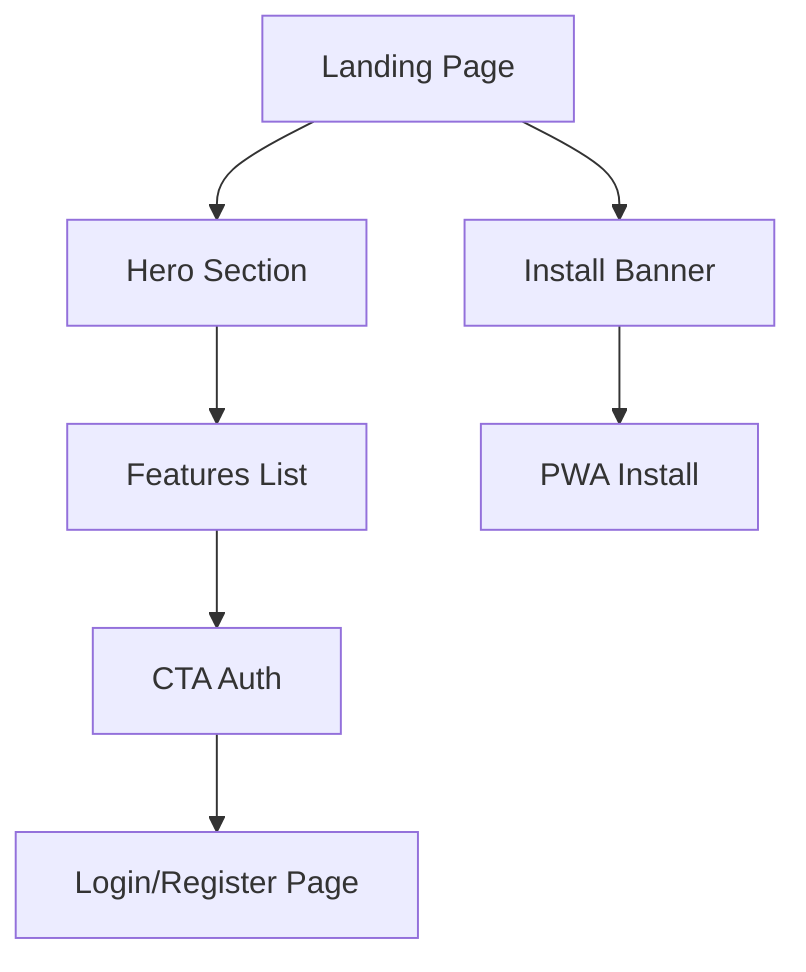

## 1. Product Overview
Landing page PWA pour promouvoir l'application mobile et faciliter l'installation. Cette page sert de point d'entrée pour convertir les visiteurs en utilisateurs actifs.

## 2. Core Features

### 2.1 User Roles
| Role | Registration Method | Core Permissions |
|------|---------------------|------------------|
| Visitor | No registration required | View landing page, install PWA |
| User | Email registration via CTA | Access full application features |

### 2.2 Feature Module
La landing page PWA comprend les modules suivants :
1. **Section Héros**: bannière principale avec message accrocheur et CTA principaux
2. **Liste Fonctionnalités**: présentation des principales fonctionnalités de l'application
3. **CTA Connexion/Inscription**: boutons d'accès à l'authentification
4. **Bannière Installation**: prompt natif PWA pour installation sur appareil

### 2.3 Page Details
| Page Name | Module Name | Feature description |
|-----------|-------------|---------------------|
| Landing Page | Hero Section | Afficher bannière principale avec titre accrocheur, sous-titre descriptif, boutons CTA Se connecter/S'inscrire en mobile-first |
| Landing Page | Features List | Présenter 3-6 fonctionnalités clés avec icônes et descriptions courtes, layout responsive |
| Landing Page | Install Banner | Afficher bannière native PWA avec bouton "Installer l'application" utilisant l'API beforeinstallprompt |
| Landing Page | Navigation | Barre de navigation fixe avec logo et boutons d'authentification |
| Landing Page | Footer | Liens vers mentions légales, confidentialité, contact |

## 3. Core Process
**Flux Visiteur** :
1. Visiteur arrive sur la landing page
2. Visualise la section héros avec CTA principaux
3. Fait défiler vers la liste des fonctionnalités
4. Clique sur "Se connecter" ou "S'inscrire"
5. Si navigateur compatible, voit la bannière d'installation PWA
6. Peut installer l'application ou continuer vers l'authentification

## 4. User Interface Design
### 4.1 Design Style
- **Couleurs**: Palette moderne avec couleur principale vive pour CTA, fond clair
- **Boutons**: Style arrondi, ombres subtiles, effet hover
- **Typographie**: Police sans-serif moderne, hiérarchie claire (titre 32px, texte 16px)
- **Layout**: Mobile-first avec breakpoints 375px, 768px, 1024px
- **Icos**: Style outline cohérent, couleurs alignées avec la palette

### 4.2 Page Design Overview
| Page Name | Module Name | UI Elements |
|-----------|-------------|-------------|
| Landing Page | Hero Section | Titre H1 32px gras, sous-titre 18px régulier, 2 boutons CTA primaires 44px hauteur, image d'illustration ou animation légère |
| Landing Page | Features List | Grille 1 colonne mobile, 2-3 colonnes desktop, cartes avec icône 48px, titre 20px, description 16px, espacement 24px |
| Landing Page | Install Banner | Bannière native en bas d'écran, bouton "Installer" avec icône app, dismiss option, respecte les guidelines PWA |
| Landing Page | Navigation | Barre fixe haute 64px, logo à gauche, boutons auth à droite, fond semi-transparent avec blur |

### 4.3 Responsiveness
Mobile-first design avec adaptation progressive :
- Mobile (375px+): Layout vertical, éléments empilés
- Tablet (768px+): Grille 2 colonnes pour features
- Desktop (1024px+): Layout horizontal hero, grille 3 colonnes features
- Touch optimization: Boutons 44px minimum, espacement adapté

### 4.4 PWA Specific Features
- Manifest.json avec icônes multiples (192px, 512px)
- Service worker pour offline capability
- Thème color pour barre d'adresse
- Apple touch icons pour iOS
- Installation prompt timing optimal (après engagement utilisateur)