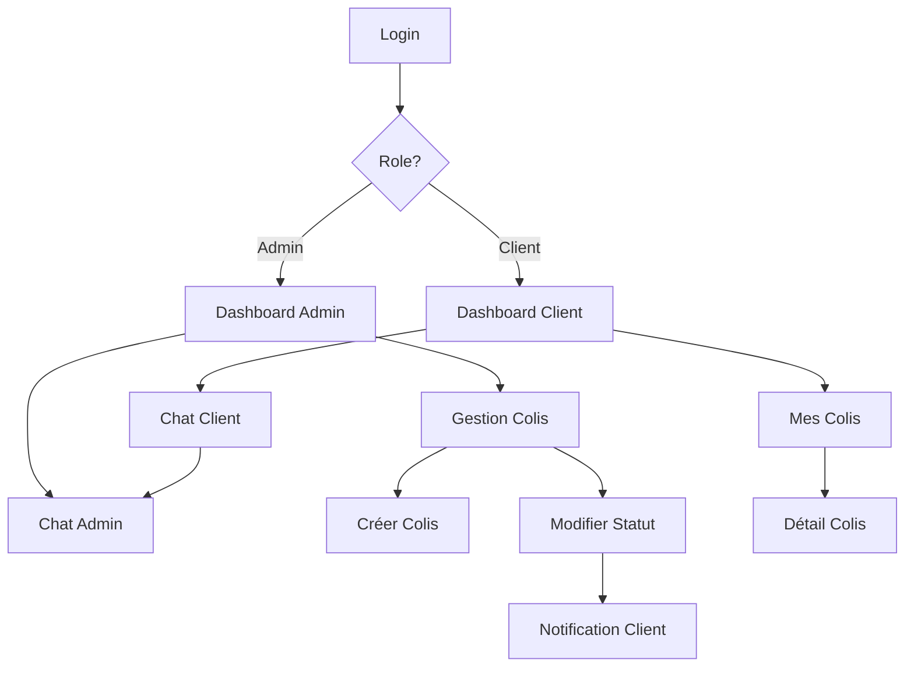

## 1. Vue d'ensemble du produit

Application de digitalisation du processus de livraison de colis de Chine vers l'Afrique. Les transitaires peuvent enregistrer les colis, notifier les clients automatiquement et permettre le suivi en temps réel jusqu'à la récupération.

Le système connecte les transitaires africains avec leurs clients finaux via une plateforme simple et robuste, adaptée aux contraintes de connectivité locales.

## 2. Fonctionnalités principales

### 2.1 Rôles utilisateurs

| Rôle | Méthode d'inscription | Permissions principales |
|------|---------------------|----------------------|
| Administrateur/Transitaire | Création de compte par admin système | Gestion complète des colis, chat avec clients, notifications |
| Client | Inscription libre avec email | Consulter ses colis, recevoir notifications, chatter avec admin |

### 2.2 Modules fonctionnels

L'application se compose des interfaces suivantes :

**Interface Administrateur (Transitaire) :**
1. **Tableau de bord admin** : vue d'ensemble des colis, statistiques, actions rapides
2. **Gestion des colis** : création, modification, association aux clients
3. **Chat admin** : communication avec les clients par colis

**Interface Client :**
4. **Tableau de bord client** : liste de ses colis avec statuts visuels
5. **Détails colis** : informations complètes et historique
6. **Chat client** : communication avec le transitaire

### 2.3 Détail des pages

| Page | Module | Description fonctionnelle |
|------|---------|--------------------------|
| Login | Authentification | Se connecter avec email/mot de passe, récupération mot de passe |
| Register | Inscription | Créer un compte client avec email, mot de passe et informations personnelles |
| Dashboard Admin | Vue d'ensemble | Afficher nombre total de colis, colis par statut, actions rapides |
| Dashboard Admin | Liste colis | Tableau paginé avec filtres par statut, client, date |
| Dashboard Admin | Créer colis | Formulaire avec numéro suivi, contenu, poids, volume, photos, client |
| Dashboard Admin | Modifier colis | Mettre à jour statut, dates, ajouter notes |
| Dashboard Admin | Chat par colis | Interface de messagerie temps réel avec historique |
| Dashboard Client | Mes colis | Liste cards avec statut visuel (badge couleur) |
| Dashboard Client | Détail colis | Vue complète avec photos, historique statuts, date estimée |
| Dashboard Client | Chat | Messagerie type WhatsApp avec notifications |

## 3. Processus principaux

### Flux Administrateur
1. Login → Dashboard avec vue d'ensemble des colis
2. Création colis → Upload photos → Association client → Enregistrement
3. Mise à jour statut → Notification automatique client
4. Réception message client → Notification → Réponse via chat

### Flux Client
1. Inscription/Login → Dashboard personnel
2. Recevoir notification nouveau colis → Consulter détails
3. Suivi statut → Notifications automatiques
4. Poser question → Chat temps réel avec transitaire

## 4. Interface utilisateur

### 4.1 Style de design

- **Couleurs principales** : Bleu marine (#1e3a8a) pour les éléments principaux, vert (#10b981) pour les statuts positifs, orange (#f59e0b) pour attention
- **Style boutons** : Arrondis avec ombres subtiles, états hover visibles
- **Typographie** : Inter ou system fonts, tailles 14-16px pour corps, 18-20px pour titres
- **Layout** : Card-based avec espacement généreux, navigation latérale sur desktop
- **Icônes** : SVG minimalistes, émojis pour les statuts (📦 🚛 🏠 ✅)

### 4.2 Vue d'ensemble des pages

| Page | Module | Éléments UI |
|------|---------|-------------|
| Dashboard Admin | Header | Logo, nom transitaire, bouton déconnexion |
| Dashboard Admin | Stats cards | Nombre colis actifs, en transit, livrés |
| Dashboard Admin | Table colis | Colonnes : Numéro, Client, Statut, Date, Actions rapides |
| Créer colis | Formulaire | Champs groupés (infos colis, photos, client), bouton submit prominent |
| Dashboard Client | Header | Logo, nom client, notifications |
| Dashboard Client | Cards colis | Chaque card : numéro, statut badge, date estimée, bouton détails |
| Chat | Interface | Liste messages style bulle, input en bas, indicateur en ligne |

### 4.3 Responsive

Mobile-first avec breakpoints :
- Mobile (< 640px) : Navigation bottom, cards empilées verticalement
- Tablette (640-1024px) : Sidebar rétractable, grille 2 colonnes
- Desktop (> 1024px) : Sidebar fixe, grille adaptable

Optimisation pour connexions limitées : lazy loading images, cache navigateur, offline mode basique.