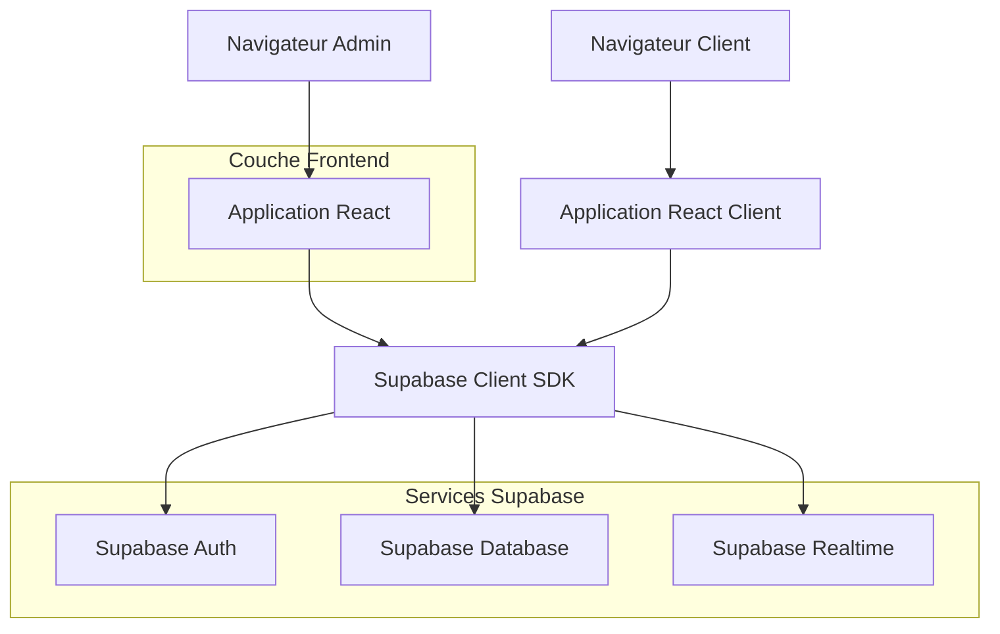
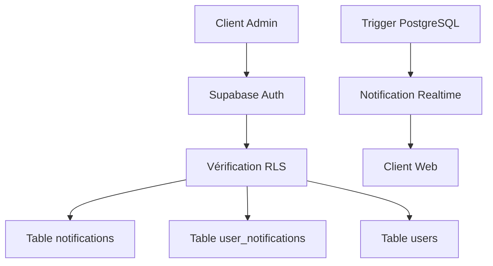
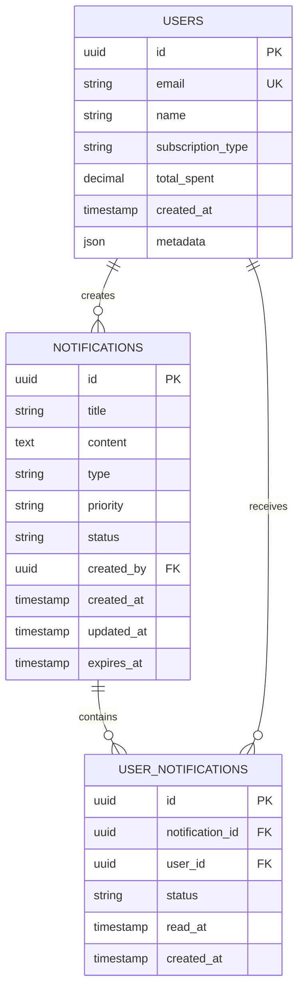

## 1. Architecture du système



## 2. Description des technologies
- **Frontend** : React@18 + TailwindCSS@3 + Vite
- **Outil d'initialisation** : vite-init
- **Backend** : Supabase (Backend-as-a-Service)
- **Base de données** : PostgreSQL via Supabase
- **Authentification** : Supabase Auth
- **Temps réel** : Supabase Realtime pour les notifications instantanées

## 3. Définition des routes
| Route | Objectif |
|-------|----------|
| /admin/notifications | Page principale de gestion des notifications avec tableau de bord |
| /admin/notifications/create | Formulaire de création d'une nouvelle notification |
| /admin/notifications/edit/:id | Édition d'une notification existante |
| /admin/notifications/send/:id | Page d'envoi ciblé avec filtres avancés |
| /admin/notifications/templates | Gestion des templates de notifications |
| /client/notifications | Page client pour voir les notifications reçues |

## 4. Définitions API

### 4.1 API Supabase - Notifications

**Créer une notification**
```javascript
const { data, error } = await supabase
  .from('notifications')
  .insert([
    {
      title: 'Nouvelle promotion',
      content: 'Contenu de la notification...',
      type: 'promotion',
      priority: 'high',
      created_by: user.id
    }
  ])
```

**Récupérer les notifications avec filtres**
```javascript
const { data, error } = await supabase
  .from('notifications')
  .select('*')
  .eq('status', 'draft')
  .order('created_at', { ascending: false })
```

**Filtrer les clients pour l'envoi ciblé**
```javascript
const { data, error } = await supabase
  .from('users')
  .select('id, email, name, subscription_type, created_at')
  .gte('created_at', startDate)
  .lte('total_spent', maxAmount)
  .eq('subscription_type', subscriptionType)
```

**Envoyer une notification à plusieurs clients**
```javascript
const notifications = recipients.map(userId => ({
  notification_id: notificationId,
  user_id: userId,
  status: 'unread'
}))

const { data, error } = await supabase
  .from('user_notifications')
  .insert(notifications)
```

## 5. Architecture serveur



## 6. Modèle de données

### 6.1 Définition du modèle



### 6.2 Langage de définition des données (DDL)

**Table des notifications**
```sql
CREATE TABLE notifications (
  id UUID PRIMARY KEY DEFAULT gen_random_uuid(),
  title VARCHAR(255) NOT NULL,
  content TEXT NOT NULL,
  type VARCHAR(50) NOT NULL CHECK (type IN ('info', 'promotion', 'urgent', 'update')),
  priority VARCHAR(20) NOT NULL CHECK (priority IN ('low', 'medium', 'high')),
  status VARCHAR(20) NOT NULL DEFAULT 'draft' CHECK (status IN ('draft', 'sent', 'archived')),
  created_by UUID REFERENCES auth.users(id),
  created_at TIMESTAMP WITH TIME ZONE DEFAULT NOW(),
  updated_at TIMESTAMP WITH TIME ZONE DEFAULT NOW(),
  expires_at TIMESTAMP WITH TIME ZONE
);

CREATE INDEX idx_notifications_status ON notifications(status);
CREATE INDEX idx_notifications_created_at ON notifications(created_at DESC);
CREATE INDEX idx_notifications_type ON notifications(type);
```

**Table des utilisateurs (extension du modèle auth.users)**
```sql
CREATE TABLE public_users (
  id UUID PRIMARY KEY REFERENCES auth.users(id) ON DELETE CASCADE,
  name VARCHAR(100) NOT NULL,
  subscription_type VARCHAR(50) DEFAULT 'free' CHECK (subscription_type IN ('free', 'premium', 'enterprise')),
  total_spent DECIMAL(10,2) DEFAULT 0,
  location VARCHAR(100),
  created_at TIMESTAMP WITH TIME ZONE DEFAULT NOW(),
  updated_at TIMESTAMP WITH TIME ZONE DEFAULT NOW()
);

CREATE INDEX idx_public_users_subscription ON public_users(subscription_type);
CREATE INDEX idx_public_users_created_at ON public_users(created_at);
```

**Table des notifications utilisateur**
```sql
CREATE TABLE user_notifications (
  id UUID PRIMARY KEY DEFAULT gen_random_uuid(),
  notification_id UUID NOT NULL REFERENCES notifications(id) ON DELETE CASCADE,
  user_id UUID NOT NULL REFERENCES public_users(id) ON DELETE CASCADE,
  status VARCHAR(20) NOT NULL DEFAULT 'unread' CHECK (status IN ('unread', 'read', 'deleted')),
  read_at TIMESTAMP WITH TIME ZONE,
  created_at TIMESTAMP WITH TIME ZONE DEFAULT NOW(),
  UNIQUE(notification_id, user_id)
);

CREATE INDEX idx_user_notifications_user ON user_notifications(user_id);
CREATE INDEX idx_user_notifications_status ON user_notifications(status);
CREATE INDEX idx_user_notifications_created ON user_notifications(created_at DESC);
```

### 6.3 Politiques de sécurité RLS (Row Level Security)

```sql
-- Politiques pour la table notifications
ALTER TABLE notifications ENABLE ROW LEVEL SECURITY;

-- Les admins peuvent tout faire
CREATE POLICY "Admins peuvent tout faire sur notifications" ON notifications
  FOR ALL USING (auth.jwt() ->> 'role' = 'admin');

-- Politiques pour user_notifications
ALTER TABLE user_notifications ENABLE ROW LEVEL SECURITY;

-- Les utilisateurs peuvent voir leurs notifications
CREATE POLICY "Users peuvent voir leurs notifications" ON user_notifications
  FOR SELECT USING (auth.uid() = user_id);

-- Les utilisateurs peuvent mettre à jour le statut de leurs notifications
CREATE POLICY "Users peuvent marquer comme lu" ON user_notifications
  FOR UPDATE USING (auth.uid() = user_id);

-- Grant permissions
GRANT SELECT ON notifications TO anon;
GRANT ALL ON notifications TO authenticated;
GRANT SELECT ON user_notifications TO authenticated;
GRANT INSERT ON user_notifications TO authenticated;
```

## 7. Fonctionnalités temps réel

**Abonnement aux nouvelles notifications**
```javascript
const subscription = supabase
  .channel('notifications')
  .on('postgres_changes', 
    { event: 'INSERT', schema: 'public', table: 'user_notifications' },
    payload => {
      console.log('Nouvelle notification:', payload.new)
      // Afficher la notification au client
    }
  )
  .subscribe()
```

## 8. Optimisations et performances

- **Pagination** : Utiliser `range()` pour limiter les résultats (max 50 par page)
- **Cache côté client** : Mettre en cache les listes de notifications et de clients
- **Indexation** : Index sur les champs fréquemment filtrés (status, type, created_at)
- **Lazy loading** : Charger les détails des notifications uniquement quand nécessaire
- **Debouncing** : Appliquer un délai de 300ms sur les filtres pour éviter trop de requêtes