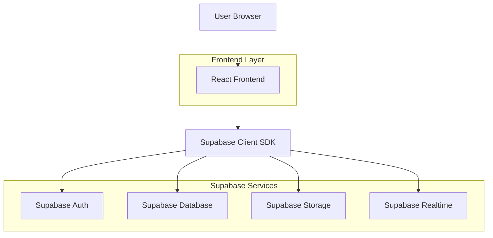
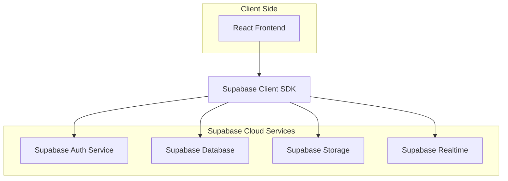
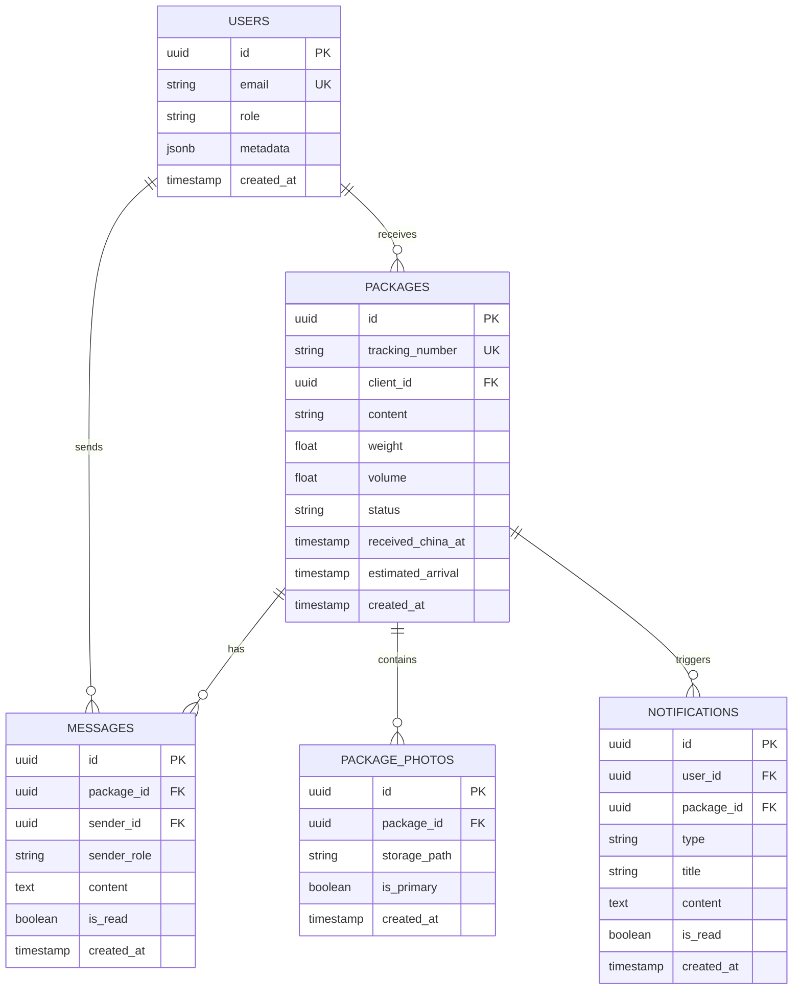

## 1. Architecture globale



## 2. Description des technologies

- **Frontend** : React@18 + TailwindCSS@3 + Vite
- **Outil d'initialisation** : vite-init
- **Backend** : Supabase (BaaS complet)
- **Base de données** : PostgreSQL (via Supabase)
- **Authentification** : Supabase Auth
- **Stockage** : Supabase Storage (photos colis)
- **Temps réel** : Supabase Realtime (chat & notifications)

## 3. Définition des routes

| Route | Description |
|-------|-------------|
| / | Page d'accueil avec choix du rôle |
| /login | Connexion utilisateur |
| /register | Inscription client |
| /admin/dashboard | Tableau de bord administrateur |
| /admin/packages | Gestion des colis |
| /admin/package/:id | Détail et modification d'un colis |
| /admin/chat/:packageId | Chat pour un colis spécifique |
| /client/dashboard | Tableau de bord client |
| /client/package/:id | Détail d'un colis client |
| /client/chat/:packageId | Chat client pour un colis |

## 4. Définitions API

### 4.1 Authentification

```
POST /auth/v1/token
```

Request:
```json
{
  "email": "user@example.com",
  "password": "password123"
}
```

### 4.2 Opérations Colis (via Supabase)

```javascript
// Créer un colis
const { data, error } = await supabase
  .from('packages')
  .insert([{
    tracking_number: 'PKG123',
    content: 'Électronique',
    weight: 2.5,
    volume: 0.01,
    client_id: 'user-uuid',
    status: 'received_china'
  }])

// Mettre à jour le statut
const { data, error } = await supabase
  .from('packages')
  .update({ status: 'in_transit' })
  .eq('id', packageId)

// Récupérer les colis d'un client
const { data, error } = await supabase
  .from('packages')
  .select('*')
  .eq('client_id', userId)
  .order('created_at', { ascending: false })
```

### 4.3 Chat temps réel

```javascript
// S'abonner aux messages d'un colis
const subscription = supabase
  .channel(`chat:${packageId}`)
  .on('postgres_changes', {
    event: 'INSERT',
    schema: 'public',
    table: 'messages',
    filter: `package_id=eq.${packageId}`
  }, payload => {
    console.log('Nouveau message:', payload.new)
  })
  .subscribe()

// Envoyer un message
const { data, error } = await supabase
  .from('messages')
  .insert([{
    package_id: packageId,
    sender_id: userId,
    content: 'Message text',
    sender_role: 'client'
  }])
```

## 5. Architecture serveur

L'architecture utilise Supabase comme backend-as-a-service, éliminant le besoin d'un serveur backend personnalisé :



## 6. Modèle de données

### 6.1 Schéma de base de données



### 6.2 Langage de définition des données (DDL)

```sql
-- Table des utilisateurs (gérée par Supabase Auth)
-- Les métadonnées incluent le rôle (admin/client)

-- Table des colis
CREATE TABLE packages (
    id UUID PRIMARY KEY DEFAULT gen_random_uuid(),
    tracking_number VARCHAR(50) UNIQUE NOT NULL,
    client_id UUID REFERENCES auth.users(id) ON DELETE CASCADE,
    content TEXT NOT NULL,
    weight DECIMAL(10,2),
    volume DECIMAL(10,4),
    status VARCHAR(30) DEFAULT 'received_china' CHECK (status IN ('received_china', 'in_transit', 'arrived_africa', 'available_warehouse', 'picked_up')),
    received_china_at TIMESTAMP WITH TIME ZONE DEFAULT NOW(),
    estimated_arrival TIMESTAMP WITH TIME ZONE,
    created_at TIMESTAMP WITH TIME ZONE DEFAULT NOW(),
    updated_at TIMESTAMP WITH TIME ZONE DEFAULT NOW()
);

-- Table des photos de colis
CREATE TABLE package_photos (
    id UUID PRIMARY KEY DEFAULT gen_random_uuid(),
    package_id UUID REFERENCES packages(id) ON DELETE CASCADE,
    storage_path TEXT NOT NULL,
    is_primary BOOLEAN DEFAULT FALSE,
    created_at TIMESTAMP WITH TIME ZONE DEFAULT NOW()
);

-- Table des messages (chat)
CREATE TABLE messages (
    id UUID PRIMARY KEY DEFAULT gen_random_uuid(),
    package_id UUID REFERENCES packages(id) ON DELETE CASCADE,
    sender_id UUID REFERENCES auth.users(id) ON DELETE CASCADE,
    sender_role VARCHAR(10) CHECK (sender_role IN ('admin', 'client')),
    content TEXT NOT NULL,
    is_read BOOLEAN DEFAULT FALSE,
    created_at TIMESTAMP WITH TIME ZONE DEFAULT NOW()
);

-- Table des notifications
CREATE TABLE notifications (
    id UUID PRIMARY KEY DEFAULT gen_random_uuid(),
    user_id UUID REFERENCES auth.users(id) ON DELETE CASCADE,
    package_id UUID REFERENCES packages(id) ON DELETE CASCADE,
    type VARCHAR(30) CHECK (type IN ('package_created', 'status_updated', 'package_arrived', 'new_message')),
    title VARCHAR(100) NOT NULL,
    content TEXT,
    is_read BOOLEAN DEFAULT FALSE,
    created_at TIMESTAMP WITH TIME ZONE DEFAULT NOW()
);

-- Index pour performances
CREATE INDEX idx_packages_client_id ON packages(client_id);
CREATE INDEX idx_packages_status ON packages(status);
CREATE INDEX idx_packages_tracking ON packages(tracking_number);
CREATE INDEX idx_package_photos_package_id ON package_photos(package_id);
CREATE INDEX idx_messages_package_id ON messages(package_id);
CREATE INDEX idx_messages_created_at ON messages(created_at);
CREATE INDEX idx_notifications_user_id ON notifications(user_id);
CREATE INDEX idx_notifications_unread ON notifications(user_id, is_read) WHERE is_read = FALSE;

-- RLS Policies
-- Packages : les clients voient uniquement leurs colis, admin voit tout
ALTER TABLE packages ENABLE ROW LEVEL SECURITY;
CREATE POLICY "Clients voient leurs colis" ON packages FOR SELECT 
    USING (auth.uid() = client_id);
CREATE POLICY "Admin voit tous les colis" ON packages FOR SELECT 
    USING (EXISTS (SELECT 1 FROM auth.users WHERE id = auth.uid() AND raw_user_meta_data->>'role' = 'admin'));
CREATE POLICY "Admin peut créer des colis" ON packages FOR INSERT 
    WITH CHECK (EXISTS (SELECT 1 FROM auth.users WHERE id = auth.uid() AND raw_user_meta_data->>'role' = 'admin'));
CREATE POLICY "Admin peut modifier les colis" ON packages FOR UPDATE 
    USING (EXISTS (SELECT 1 FROM auth.users WHERE id = auth.uid() AND raw_user_meta_data->>'role' = 'admin'));

-- Messages : participants du colis peuvent voir les messages
ALTER TABLE messages ENABLE ROW LEVEL SECURITY;
CREATE POLICY "Voir messages du colis" ON messages FOR SELECT 
    USING (EXISTS (SELECT 1 FROM packages WHERE id = package_id AND (client_id = auth.uid() OR EXISTS (SELECT 1 FROM auth.users WHERE id = auth.uid() AND raw_user_meta_data->>'role' = 'admin'))));
CREATE POLICY "Envoyer messages" ON messages FOR INSERT 
    WITH CHECK (sender_id = auth.uid());

-- Notifications : utilisateurs voient leurs notifications
ALTER TABLE notifications ENABLE ROW LEVEL SECURITY;
CREATE POLICY "Voir ses notifications" ON notifications FOR SELECT 
    USING (auth.uid() = user_id);
CREATE POLICY "Marquer comme lu" ON notifications FOR UPDATE 
    USING (auth.uid() = user_id);
```

## 7. Stratégie de notifications

### 7.1 Notifications temps réel (Supabase Realtime)

```javascript
// Configuration des abonnementsconst setupRealtimeSubscriptions = (userId, userRole) => {
  // Admin : écoute tous les nouveaux messages
  if (userRole === 'admin') {
    supabase
      .channel('admin-messages')
      .on('postgres_changes', {
        event: 'INSERT',
        schema: 'public',
        table: 'messages'
      }, handleNewMessage)
      .subscribe()
  }
  
  // Client : écoute ses notifications
  supabase
    .channel(`user-notifications:${userId}`)
    .on('postgres_changes', {
      event: 'INSERT',
      schema: 'public',
      table: 'notifications',
      filter: `user_id=eq.${userId}`
    }, handleNewNotification)
    .subscribe()
}
```

### 7.2 Notifications Push (PWA optionnel)

```javascript
// Service Worker pour PWA
self.addEventListener('push', event => {
  const data = event.data.json()
  self.registration.showNotification(data.title, {
    body: data.body,
    icon: '/icon-192x192.png',
    badge: '/badge-72x72.png',
    vibrate: [200, 100, 200]
  })
})
```

## 8. Évolutivité future

### Phase 2 - Paiement
- Intégration Stripe/PayPal pour paiement en ligne
- Table `payments` liée aux colis
- Gestion des devis et factures

### Phase 3 - Tracking GPS
- Intégration API GPS pour suivi en temps réel
- Carte interactive avec position du colis
- Historique des positions

### Phase 4 - QR Code
- Génération QR code par colis
- Scan mobile pour mise à jour rapide du statut
- Application mobile dédiée pour les agents